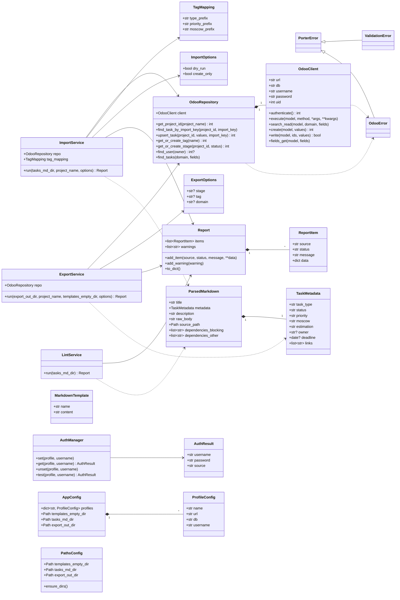

```mermaid
classDiagram
direction LR

class PorterError
class ValidationError
class OdooError
PorterError <|-- ValidationError
PorterError <|-- OdooError

class TaskMetadata {
  +str task_type
  +str status
  +str priority
  +str moscow
  +str estimation
  +str? owner
  +date? deadline
  +list~str~ links
}

class ParsedMarkdown {
  +str title
  +TaskMetadata metadata
  +str description
  +str raw_body
  +Path source_path
  +list~str~ dependencies_blocking
  +list~str~ dependencies_other
}

class ReportItem {
  +str source
  +str status
  +str message
  +dict data
}

class Report {
  +list~ReportItem~ items
  +list~str~ warnings
  +add_item(source, status, message, **data)
  +add_warning(warning)
  +to_dict()
}

Report "1" *-- "*" ReportItem
ParsedMarkdown "1" *-- "1" TaskMetadata

class OdooClient {
  +str url
  +str db
  +str username
  +str password
  +int uid
  +authenticate() int
  +execute(model, method, *args, **kwargs)
  +search_read(model, domain, fields)
  +create(model, values) int
  +write(model, ids, values) bool
  +fields_get(model, fields)
}

class OdooRepository {
  +OdooClient client
  +get_project_id(project_name) int
  +find_task_by_import_key(project_id, import_key)
  +upsert_task(project_id, values, import_key) int
  +get_or_create_tag(name) int
  +get_or_create_stage(project_id, status) int
  +find_user(owner) int?
  +find_tasks(domain, fields)
}

OdooRepository "1" *-- "1" OdooClient
OdooClient ..> OdooError
OdooRepository ..> OdooError

class TagMapping {
  +str type_prefix
  +str priority_prefix
  +str moscow_prefix
}

class ImportOptions {
  +bool dry_run
  +bool create_only
}

class ImportService {
  +OdooRepository repo
  +TagMapping tag_mapping
  +run(tasks_md_dir, project_name, options) Report
}
ImportService --> OdooRepository
ImportService --> TagMapping
ImportService --> ImportOptions
ImportService --> Report
ImportService ..> ParsedMarkdown

class ExportOptions {
  +str? stage
  +str? tag
  +str? domain
}

class ExportService {
  +OdooRepository repo
  +run(export_out_dir, project_name, templates_empty_dir, options) Report
}
ExportService --> OdooRepository
ExportService --> ExportOptions
ExportService --> Report
ExportService ..> TaskMetadata

class LintService {
  +run(tasks_md_dir) Report
}
LintService --> Report
LintService ..> ParsedMarkdown

class MarkdownTemplate {
  +str name
  +str content
}
class AuthResult {
  +str username
  +str password
  +str source
}
class AuthManager {
  +set(profile, username)
  +get(profile, username) AuthResult
  +unset(profile, username)
  +test(profile, username) AuthResult
}
AuthManager --> AuthResult

class ProfileConfig {
  +str name
  +str url
  +str db
  +str username
}
class AppConfig {
  +dict~str, ProfileConfig~ profiles
  +Path templates_empty_dir
  +Path tasks_md_dir
  +Path export_out_dir
}
AppConfig "1" *-- "*" ProfileConfig

class PathsConfig {
  +Path templates_empty_dir
  +Path tasks_md_dir
  +Path export_out_dir
  +ensure_dirs()
}

```
