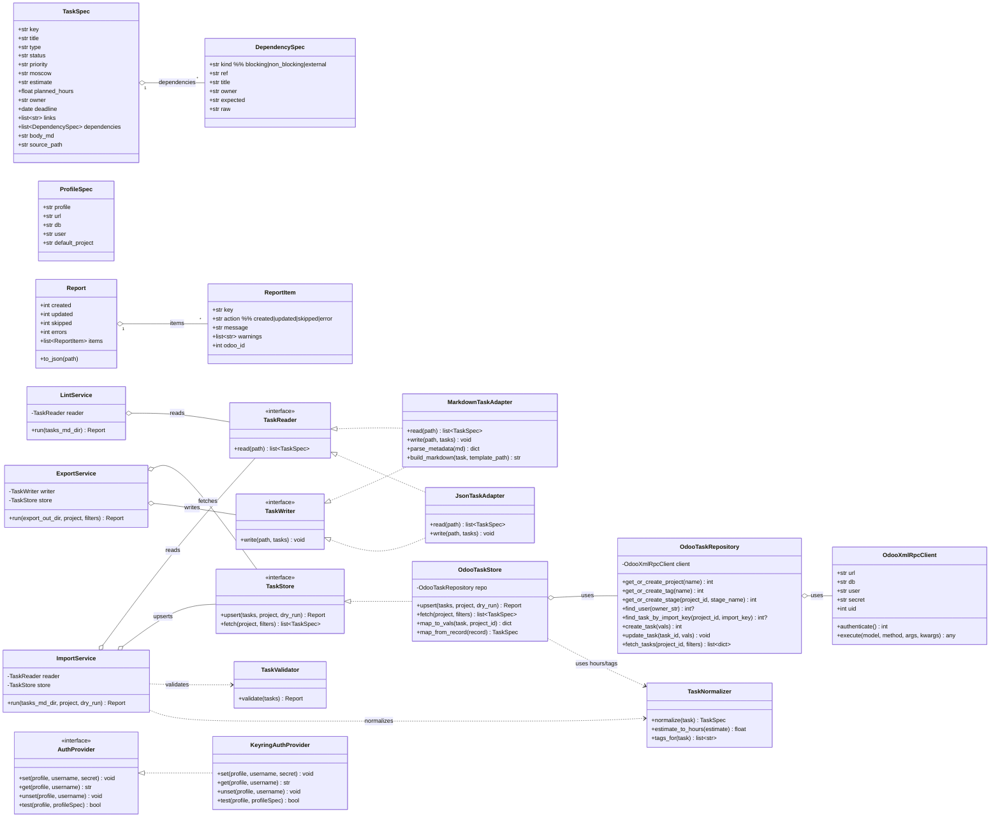

```mermaid
classDiagram
direction LR

%% =========================
%% DOMAIN (canonical model)
%% =========================
class TaskSpec {
  +str key
  +str title
  +str type
  +str status
  +str priority
  +str moscow
  +str estimate
  +float planned_hours
  +str owner
  +date deadline
  +list~str~ links
  +list~DependencySpec~ dependencies
  +str body_md
  +str source_path
}

class DependencySpec {
  +str kind  %% blocking|non_blocking|external
  +str ref
  +str title
  +str owner
  +str expected
  +str raw
}

class ProfileSpec {
  +str profile
  +str url
  +str db
  +str user
  +str default_project
}

class Report {
  +int created
  +int updated
  +int skipped
  +int errors
  +list~ReportItem~ items
  +to_json(path)
}

class ReportItem {
  +str key
  +str action  %% created|updated|skipped|error
  +str message
  +list~str~ warnings
  +int odoo_id
}

TaskSpec "1" o-- "*" DependencySpec : dependencies
Report "1" o-- "*" ReportItem : items

%% =========================
%% PORTS / INTERFACES
%% =========================
class TaskReader {
  <<interface>>
  +read(path) list~TaskSpec~
}

class TaskWriter {
  <<interface>>
  +write(path, tasks) void
}

class TaskStore {
  <<interface>>
  +upsert(tasks, project, dry_run) Report
  +fetch(project, filters) list~TaskSpec~
}

class AuthProvider {
  <<interface>>
  +set(profile, username, secret) void
  +get(profile, username) str
  +unset(profile, username) void
  +test(profile, profileSpec) bool
}

%% =========================
%% ADAPTERS (Markdown/JSON)
%% =========================
class MarkdownTaskAdapter {
  +read(path) list~TaskSpec~
  +write(path, tasks) void
  +parse_metadata(md) dict
  +build_markdown(task, template_path) str
}

class JsonTaskAdapter {
  +read(path) list~TaskSpec~
  +write(path, tasks) void
}

TaskReader <|.. MarkdownTaskAdapter
TaskWriter <|.. MarkdownTaskAdapter
TaskReader <|.. JsonTaskAdapter
TaskWriter <|.. JsonTaskAdapter

%% =========================
%% AUTH (Keyring)
%% =========================
class KeyringAuthProvider {
  +set(profile, username, secret) void
  +get(profile, username) str
  +unset(profile, username) void
  +test(profile, profileSpec) bool
}

AuthProvider <|.. KeyringAuthProvider

%% =========================
%% ODOO INFRA
%% =========================
class OdooXmlRpcClient {
  +str url
  +str db
  +str user
  +str secret
  +int uid
  +authenticate() int
  +execute(model, method, args, kwargs) any
}

class OdooTaskRepository {
  -OdooXmlRpcClient client
  +get_or_create_project(name) int
  +get_or_create_tag(name) int
  +get_or_create_stage(project_id, stage_name) int
  +find_user(owner_str) int?
  +find_task_by_import_key(project_id, import_key) int?
  +create_task(vals) int
  +update_task(task_id, vals) void
  +fetch_tasks(project_id, filters) list~dict~
}

class OdooTaskStore {
  -OdooTaskRepository repo
  +upsert(tasks, project, dry_run) Report
  +fetch(project, filters) list~TaskSpec~
  +map_to_vals(task, project_id) dict
  +map_from_record(record) TaskSpec
}

TaskStore <|.. OdooTaskStore
OdooTaskRepository o-- OdooXmlRpcClient : uses
OdooTaskStore o-- OdooTaskRepository : uses

%% =========================
%% SERVICES (use-cases)
%% =========================
class ImportService {
  -TaskReader reader
  -TaskStore store
  +run(tasks_md_dir, project, dry_run) Report
}

class ExportService {
  -TaskWriter writer
  -TaskStore store
  +run(export_out_dir, project, filters) Report
}

class LintService {
  -TaskReader reader
  +run(tasks_md_dir) Report
}

ImportService o-- TaskReader : reads
ImportService o-- TaskStore : upserts
ExportService o-- TaskStore : fetches
ExportService o-- TaskWriter : writes
LintService o-- TaskReader : reads

%% =========================
%% OPTIONAL: RULES/MAPPING (functions or classes)
%% =========================
class TaskValidator {
  +validate(tasks) Report
}

class TaskNormalizer {
  +normalize(task) TaskSpec
  +estimate_to_hours(estimate) float
  +tags_for(task) list~str~
}

ImportService ..> TaskValidator : validates
ImportService ..> TaskNormalizer : normalizes
OdooTaskStore ..> TaskNormalizer : uses hours/tags
```
